---

layout: default

title: rafQueue — stretch heavy js operations in time

---

# Яндекс

## **{{ page.title }}** {#cover}

    
Картинки

	
{{ site.author.name }}

## 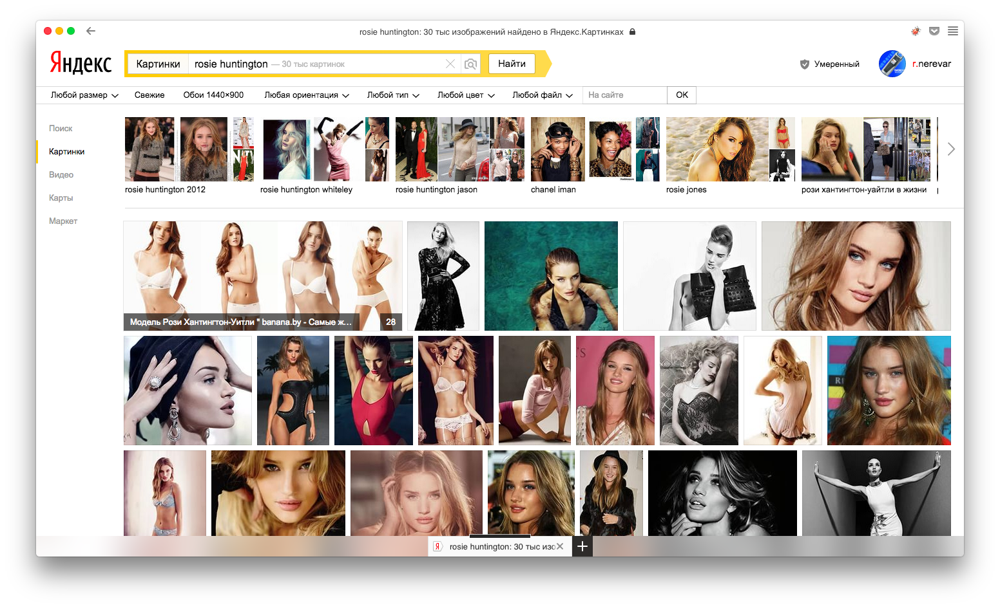
{:.cover .h}

## 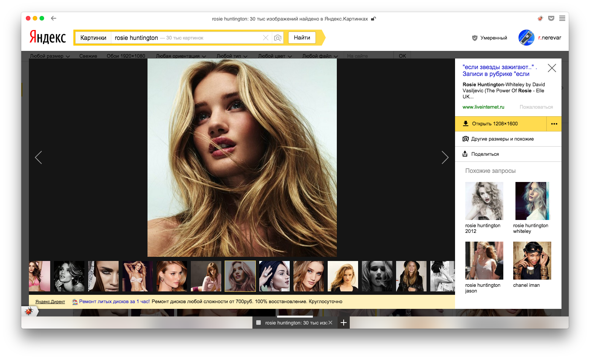
{:.cover .h}

## 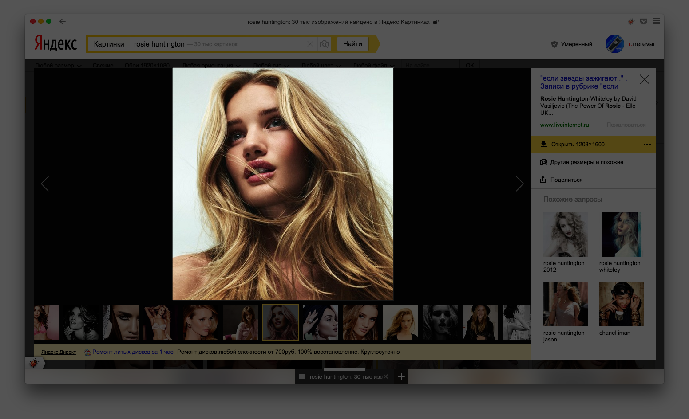
{:.cover .h}

## 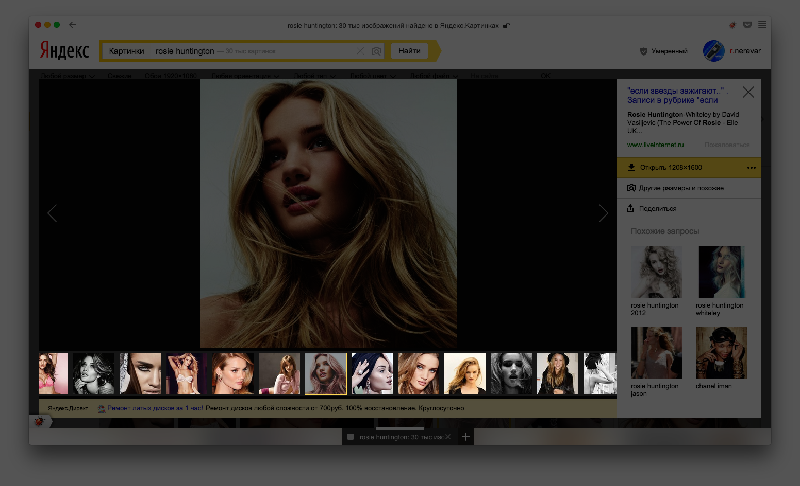
{:.cover .h}

## 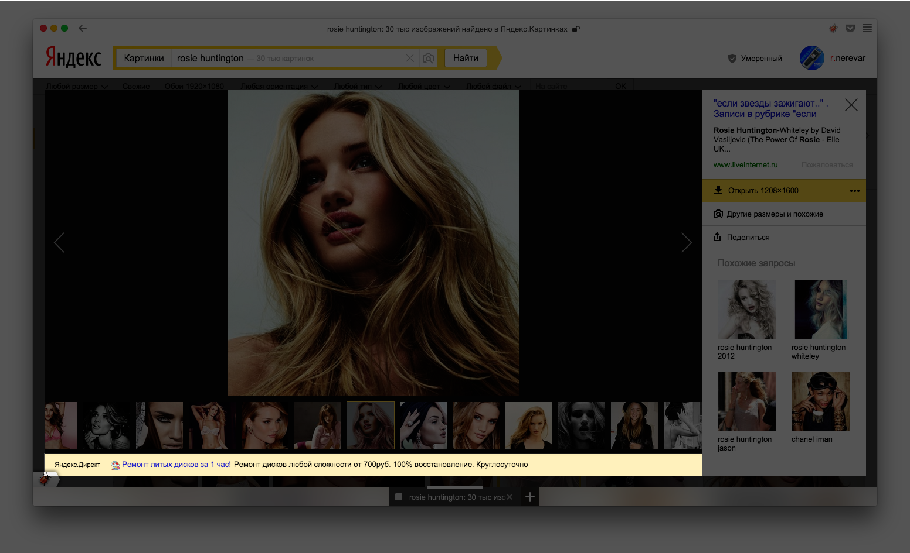
{:.cover .h}

## 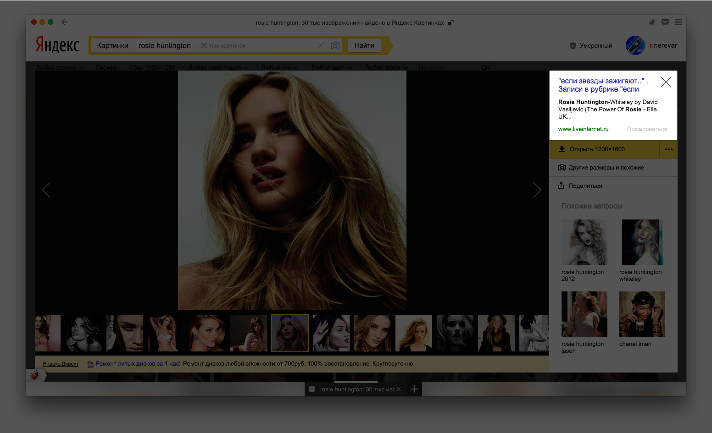
{:.cover .h}

## 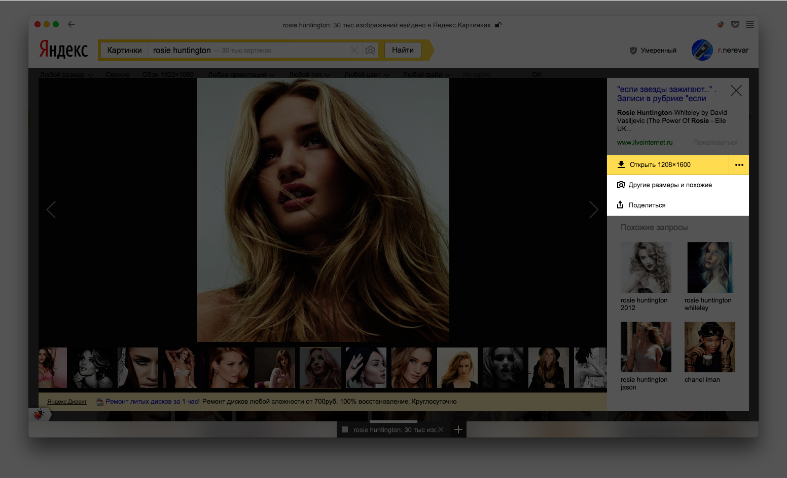
{:.cover .h}

## 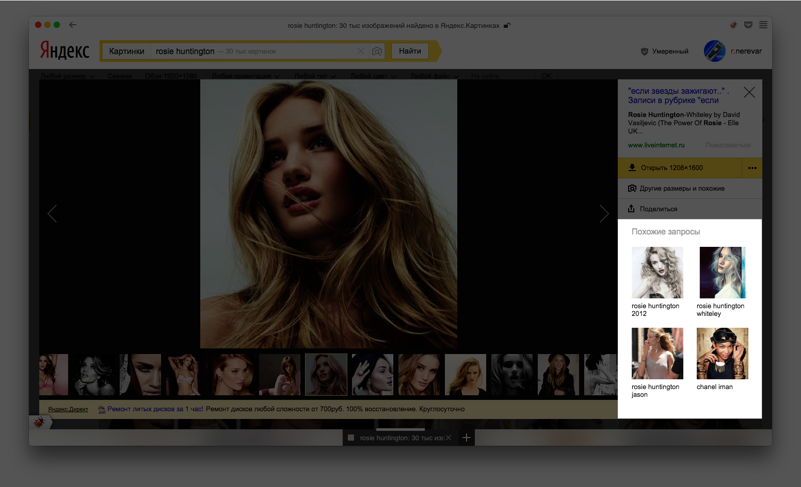
{:.cover .h}

## 
{:.cover .h}

## Анимация с setTimeout/setInterval
{:.m0}
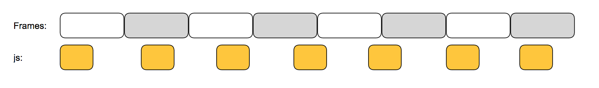
{:.h140}

~~~ javascript
function step() {
    // alter dom, change styles
    // ...
    
    // schedule next frame
    setTimeout(step, 16.667);
}
step();
~~~

## Анимация с setTimeout/setInterval
{:.m0}
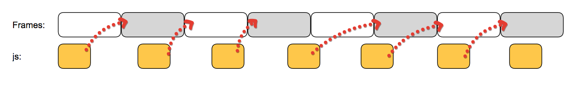
{:.h140}

~~~ javascript
function step() {
    // alter dom, change styles
    // ...
    
    // schedule next frame
    setTimeout(step, 16.667);
}
step();
~~~

## Анимация с requestAnimationFrame
{:.m0}
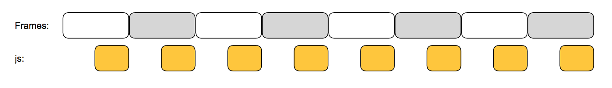
{:.h140}

~~~ javascript
function step() {
    // alter dom, change styles
    // ...
    
    // schedule next frame
    requestAnimationFrame(step);
}
step();
~~~

## Анимация с requestAnimationFrame
{:.m0}
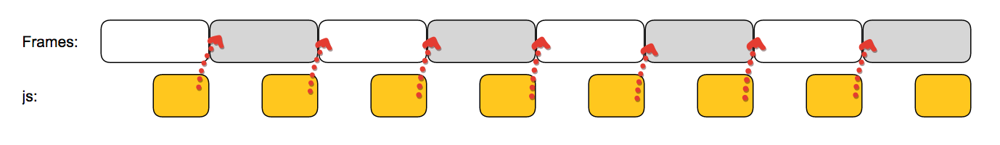
{:.h140}

~~~ javascript
function step() {
    // alter dom, change styles
    // ...
    
    // schedule next frame
    requestAnimationFrame(step);
}
step();
~~~

## requestAnimationFrame
{:.bigger .m30}
* работает с частотой обновления экрана
  * позволяет избежать выпавших кадров
* браузер может оптимизировать анимацию
  * анимация более плавная
* анимация в неактивной вкладке браузера будет приостановлена
  * снижает нагрузку CPU в фоне

## rafQueue
{:.code-36 .low}
~~~ javascript
var queue = new window.rafQueue();

queue
    .add(function() { loadFirst(); })
    .add(function() { animateSecond(); })
    .add(function() {
        this.runThirdInCtx();
    }, this);

queue.run();
~~~

## 
{:.cover .h}

## Загрузка картинки последовательная
{:.code-30 .m30}

~~~ javascript
function load(item) {
    this
        .updatePreview(item.image)
        .selectGalleryItem(item.id)
        .updateLinks(item.snippet)
        .loadDirect(item.snippet.text)
        ...
}
~~~
{:.tall}

## Загрузка картинки через rafQueue
{:.raf-code .m30}

~~~ javascript
var queue = new window.rafQueue();

function load(item) {
 var _this = this;
 queue
  .add(function() { _this.updatePreview(item); })
  .add(function() { _this.selectGalleryItem(item); })
  .add(function() { _this.updateLinks(item); })
  ...

  queue.run();
}
~~~

## 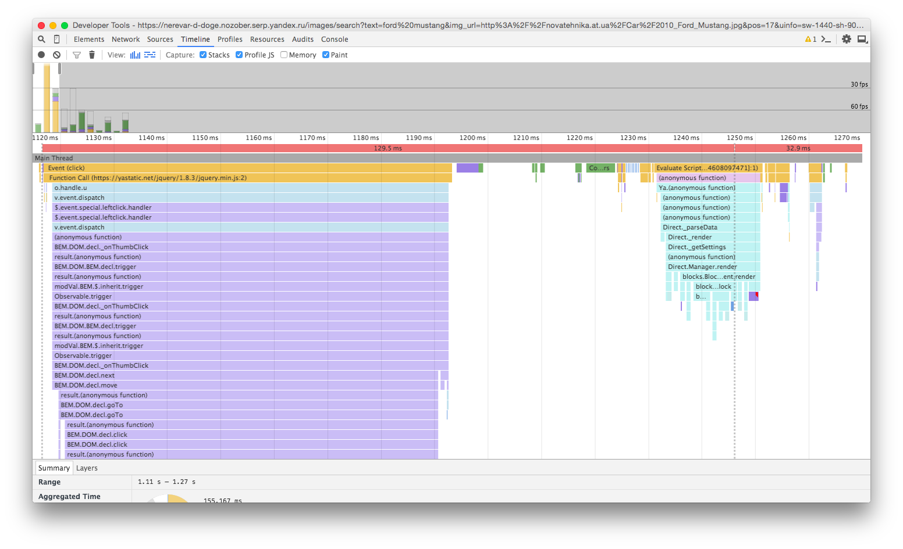
{:.cover .h}

## 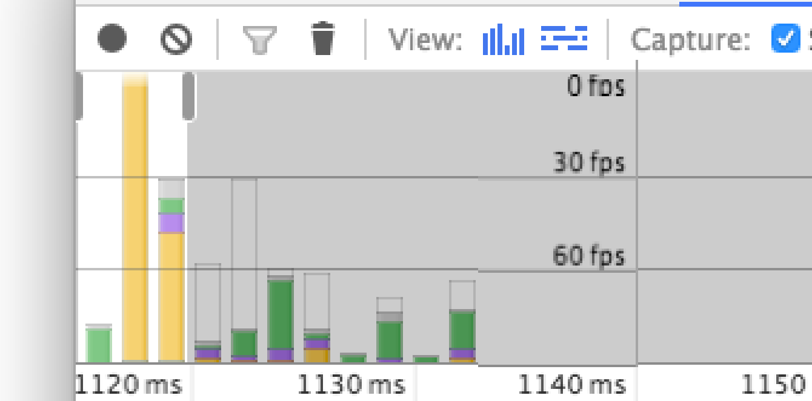
{:.cover .h}

## 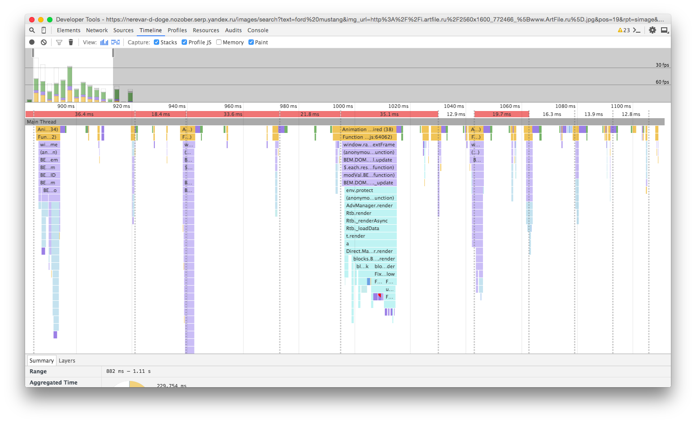
{:.cover .h}

## 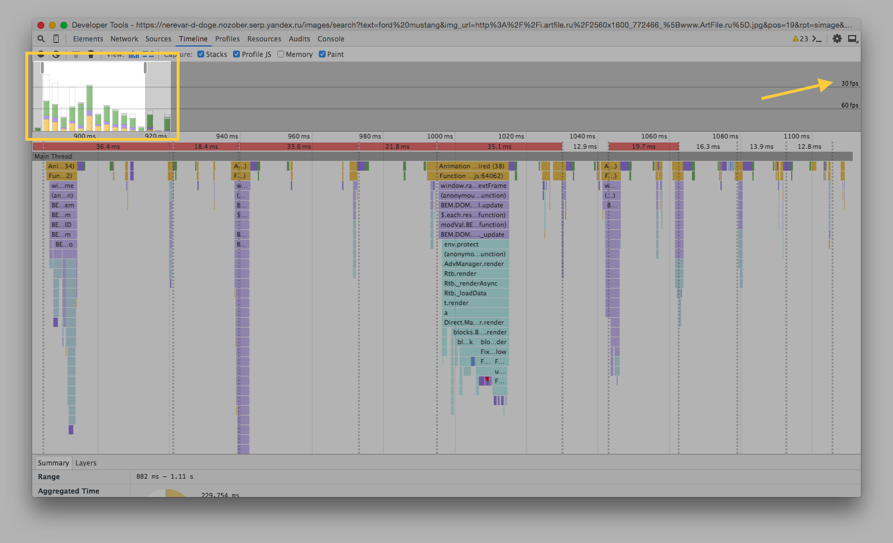
{:.cover .h}

## [https://github.com/nerevar/rafQueue](https://github.com/nerevar/rafQueue)
{:.center .bigger .image-center}

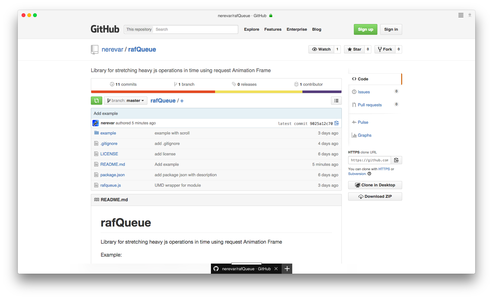

## Вопросы ?
{:.middle}

## **Контакты** {#contacts}

{{ site.author.name }}

    
{{ site.author.position }}

    

        <!-- 
+7 (000) 000-00-00
 -->
        
nerevar@yandex-team.ru

        
@nerevar1n

        <!-- 
vk
 -->
        <!-- 
facebook
 -->
    

